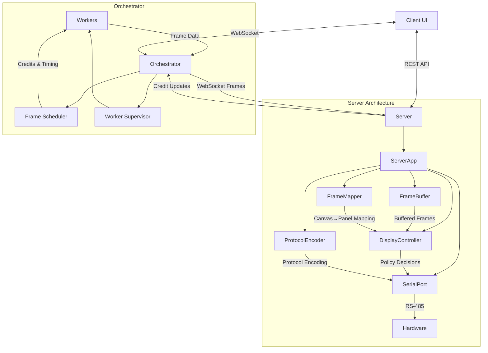

# Flip Disc Display System

A complete system for controlling Alpha Zeta flip disc displays with smooth animations and flexible panel arrangements.

## Architecture

The system follows a clean separation of concerns with proper dependency injection:

- **Server (Python)** - Hardware communication and frame buffering with clean architecture
- **Orchestrator (JS/Bun)** - Animation control and worker coordination  
- **Workers** - Frame generation (simple patterns → p5.js animations)
- **Client** - Web UI for control and preview

## Data Flow



## Hardware & Protocol

- Display panels: Alpha Zeta flip‑disc, 7×28 pixels per panel (also supports 7×7 and 14×7)
- Bus: RS‑485, each panel has an address; broadcast supported
- Panel update unit: full panel only — no single‑pixel writes
- Protocol (manufacturer spec):
  - Frame: `[0x80][command][address][payload...][0x8F]`
  - Commands: `0x83` (instant), `0x84` (buffered), flush: `[0x80, 0x82, 0x8F]`
  - Payload: 1 byte per column; 7 data bits (LSB = top), MSB ignored
- Typical refresh: ~15 FPS; target up to 30 FPS

See `flipdots_protocols.md` for the original notes.

## Frame Timing

- Server owns pacing using a fixed refresh rate
- Async frame buffer maintains ~0.5 s of frames
- Credit system prevents overfilling: orchestrator only generates when credits > 0
- Credits increase as frames are consumed at the display rate

## Tech Stack & Libraries

- Server (Python): FastAPI, uvicorn, numpy, aioserial, Kaitai
- Orchestrator (Bun/TS): Bun.serve, Workers API, zod (guards), Biome for lint/format
- Testing: pytest (server), Bun test (orchestrator)

## Configuration Management

- Server config file: `server/config.toml`
  - Simple schema: `[display] panel_type|columns|rows|refresh_rate|buffer_duration`, `[serial]`
  - Or explicit `[[panels]]` with per‑panel positions and sizes
- Environment:
  - Server CORS allowlist via `ALLOWED_ORIGINS` (comma‑separated, `*` in dev)
  - Orchestrator endpoints configurable in `ServerCommunicationService`

## Resilience

- Orchestrator WebSocket reconnects with backoff
- Server WebSocket accepts frames defensively and reports errors/credits
- DisplayController isolates I/O; MockSerialPort supports full dev without hardware

## Design Constraints

- Local network (low latency) between orchestrator and server
- Canvas frames are WS row‑stride (compact); protocol output is column‑wise (per manufacturer)
- Panel orientations supported: `normal`, `rot90`, `rot180`, `rot270`

## Roadmap (Implementation Priorities)

1. Core frame flow (Server ↔ Orchestrator ↔ Simple Worker)
2. Basic UI for control and preview
3. Optimizations (dirty frames, deduplication, adaptive FPS)
4. Complex workers (p5.js/processing.js)
5. Python workers for image/video

## Common Pitfalls

- Letting workers free‑run without credits wastes CPU and fills buffers
- Forgetting entire‑panel update requirement
- RS‑485 bandwidth limits; large layouts benefit from dirty/diff updates
- Ensure the server remains the frame‑rate owner

## Future Extensibility

- Multiple displays/servers
- Effect pipeline (invert/flip/threshold)
- Playlist/scheduling of animations
- Computer‑vision inputs and Python workers

## Quick Start

### Server Setup
```bash
cd server
# Recommended: one-liner bootstrapping
./setup.sh

# Start server
uv run python -m src.main
```

Server runs on http://localhost:8000

### Orchestrator Setup
```bash
cd orchestrator
bun install
bun run dev
```

Orchestrator runs on http://localhost:3000 and connects to the server at http://localhost:8000 (WebSocket ws://localhost:8000/ws/frames).

### Run Tests
```bash
cd server
uv run pytest -q
```

## Project Status

✅ **Server** - Complete with tests  
🚧 **Orchestrator** - In development  
⏳ **Workers** - Planned  
⏳ **Client** - Planned  

## Hardware Support

- **Display**: Alpha Zeta flip disc panels (7×28 pixels)
- **Communication**: RS-485 serial protocol
- **Layouts**: Single panel, stacked, side-by-side, custom arrangements
- **Refresh Rate**: Up to 30 FPS

## Development

Each component has its own setup and documentation:

- [`server/README.md`](server/README.md) — Python server (APIs, protocol, testing)
- [`orchestrator/README.md`](orchestrator/README.md) — Bun orchestrator (workers, sockets, tests)
- `client/README.md` — Coming soon

## Configuration

The server uses `config.toml` for display configuration:

```toml
[display]
panel_type = "28x7"     # "7x7", "14x7", or "28x7"
columns = 2             # Number of panels horizontally
rows = 1                # Number of panels vertically
refresh_rate = 30.0     # Target FPS
buffer_duration = 0.5   # Frame buffer duration in seconds

[serial]
port = "/dev/ttyUSB0"
baudrate = 9600
timeout = 1.0
mock = true             # Set false for real hardware
```

## Features

- **Credit System** - Prevents buffer overflow with real-time flow control
- **Panel Mapping** - Automatic canvas-to-panel conversion with orientations
- **Mock Mode** - Full development workflow without hardware
- **Test Patterns** - Built-in patterns for hardware verification
- **WebSocket + REST** - Efficient frame delivery and control APIs

## Project Structure

```
flip-disc-project/
├── server/
│   ├── src/
│   │   ├── main.py            # Entry point (FastAPI factory)
│   │   ├── server_app.py      # Composition root & DI
│   │   ├── display_controller.py # Policy + RS-485 orchestration
│   │   ├── frame_buffer.py    # Buffer + credits
│   │   ├── frame_mapper.py    # Canvas → panels (pure)
│   │   ├── protocol_encoder.py# Protocol framing (pure)
│   │   └── serial_port.py     # Hardware / mock I/O boundary
│   ├── tests/                 # Unit + smoke tests
│   └── pyproject.toml
├── orchestrator/
│   ├── src/
│   │   ├── index.ts           # Bun.serve + orchestrator wiring
│   │   ├── services/          # Server comms + scheduler
│   │   ├── sockets/           # UI + server WS handlers
│   │   └── workers/           # Animation workers + pipeline
│   └── README.md
└── README.md                  # This file
```

## Key Decisions (Summary)

- Server owns the display rate. Orchestrator respects credits to prevent overflow.
- Binary WS frames use a Kaitai‑defined format; server validates dimensions/length.
- Panel payloads are column‑wise at the protocol boundary; canvas frames are row‑stride in WS payloads for compactness.
- Clean architecture: pure mapping/encoding separated from I/O and policy for testability.

## Worker Architecture (Summary)

- Bun Workers generate frames on demand, coordinated by a Frame Scheduler.
- The scheduler maintains `next_frame_time` and consumes credits before sending.
- Multiple listeners can subscribe to events (credits_updated, frame_ready, etc.).

## Optimizations (Roadmap)

- Dirty frame detection per panel
- Frame deduplication
- Adaptive FPS for static content
- Per‑panel diff to minimize serial I/O

## Testing Strategy

- Pure units for mapper/encoder and validation
- Buffer + credit system tests
- Protocol packing tests (column‑wise bytes, LSB=top)
- WebSocket smoke test exercising enqueue and credit updates

See `server/README.md` and `orchestrator/README.md` for commands.
