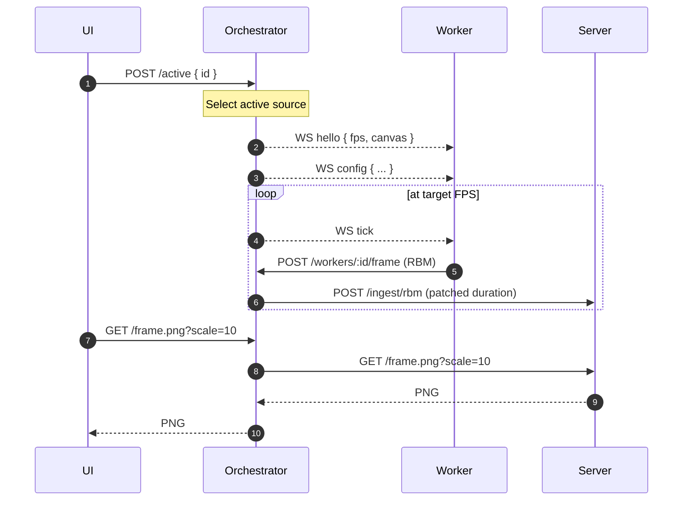
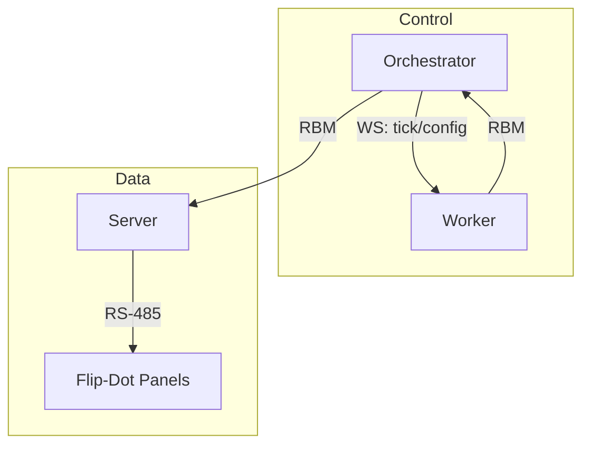

# Flip‑Disc — Drive Flip‑Dot Displays End‑to‑End

Flip‑disc (aka flip‑dot) displays flip small discs to show black/white pixels. This repo provides an end‑to‑end stack to render content and drive real hardware.

- Server: Python FastAPI app that maps a virtual canvas to physical panels and writes RS‑485 with stable pacing
- Orchestrator: Bun/TypeScript app that drives workers via WebSocket ticks and forwards frames to the server
- Workers: Python processes that render frames on demand and post them as 1‑bit RBM bitmaps


Project Structure
- `server/`: Display server (pacing, mapping, RS‑485, PNG preview). See `server/README.md`.
- `orchestrator/`: Worker control plane + simple UI. WS ticks/config, frame forwarding. See `orchestrator/README.md`.
- `workers/`: Worker SDK and examples (bouncing‑dot, text‑scroll). See `workers/README.md`.
- `config/display.yaml`: Canvas, panel topology, serial settings.
- `protocol/rbm_spec.md`: RBM wire format.


How It Works
- Orchestrator is the timing authority. It sends WebSocket ticks to the active worker at target FPS and pushes live config.
- Workers render on ticks and POST RBM frames to the orchestrator ingest endpoint.
- Orchestrator forwards each frame to the server, patching frame duration to match pacing.
- Server buffers and writes frames over RS‑485, mapping the canvas to physical panels; a PNG preview is exposed for development.

Diagrams





Getting Started
- Prereqs: Python 3.11+, uv, Bun
- Install deps: `make uv-setup` (server), `make uv-setup-workers` (workers), `make bun-setup` (orchestrator)
- Run (3 terminals):
  - Server: `make run-server` → http://localhost:8080
  - Orchestrator: `make run-orchestrator` → http://localhost:8090
  - Worker: `cd workers && uv run python runner.py text-scroll`
- UI: Pick an active worker and tweak config at http://localhost:8090 (preview proxies the server’s PNG)

Deploy
- Raspberry Pi setup and systemd units: `deploy/README-systemd.md`

More Docs
- Server details: `server/README.md`
- Orchestrator details: `orchestrator/README.md`
- Worker SDK and examples: `workers/README.md`
- Start the server and orchestrator (as above), then set `/active` to `bouncing-dot`.
- The orchestrator will spawn the worker; open the viewer and you should see the dot animating.
- Optional: to bypass the orchestrator, run the worker manually with `TARGET_URL=http://localhost:8080/ingest/rbm`.

Stop the active worker
- From the UI, click “Stop Active”, or via API: `curl -XPOST localhost:8090/active -H 'Content-Type: application/json' -d '{"id":null}'`.

Restart the active worker
- From the UI, click “Restart Active”, or via API sequence:
  - `curl -XPOST localhost:8090/workers/<id>/stop`
  - `curl -XPOST localhost:8090/workers/<id>/start`
  
Preview scale
- In the UI’s Server section, adjust the numeric Scale control (1–64). The preview image uses this scale when fetching `/frame.png`.

Worker config via orchestrator
- Workers poll `GET /workers/:id/config` ~1 Hz; you can update settings via the UI or `curl`:
  - `curl -XPOST localhost:8090/workers/text-scroll/config -H 'Content-Type: application/json' -d '{"text":"HELLO","pps":12,"letter_spacing":1}'`


**Server Flags (CLI after `--`)**
- `--config config/display.yaml`
- `--fps 30` (overrides config)
- `--buffer_ms 1000` (~1s ring buffer)
- `--frame_gap_ms N` (min gap after each frame)
- `--serial` (enable RS‑485)
- `--serial_device /dev/ttyUSB0`, `--serial_baud 115200`
- `--serial_parity none|even|odd`, `--serial_databits 8`, `--serial_stopbits 1`
- `--serial_interpanel_us N` (microseconds between panel packets)


**Endpoints**
- Server: `POST /ingest/rbm`, `GET /frame.png?scale=10`, `GET /debug/panel.png?id=top&scale=20`, `GET /config`, `GET /stats`, `GET /healthz`.
- Orchestrator: `POST /workers/:id/frame`, `POST /active`, `GET /active`, `GET /stats`, `GET /config`, `GET /healthz`.
  - Worker config endpoints (orchestrator): `GET/POST /workers/:id/config` (used by text-scroll worker for text/speed).
  - Ingest validation: RBM header magic/version are checked; frames are rejected if `width/height` don’t match the server canvas.
  - Proxy: `GET /frame.png` forwards to server `/frame.png` for the UI preview.

Worker process management (orchestrator)
- `POST /workers/:id/start` and `POST /workers/:id/stop`
- `POST /active {"id": "<worker-id>"}` to switch and auto start; `{"id": null}` to stop current.
- `/stats` and `/active` include `running` list.

**Troubleshooting**
- “Multiple top-level packages discovered” during `uv sync` in `workers/`:
  - Fixed by declaring no packages in `workers/pyproject.toml` (`tool.setuptools.packages = []`). Run `make uv-setup-workers` again.
- Worker doesn’t auto-start when setting `/active`:
  - Ensure `uv` is installed and on PATH; run `uv --version`. If missing, install per “One-time setup”.
  - Ensure `make uv-setup-workers` was run to create the workers’ venv.
  - Check orchestrator logs for spawn errors.
- RBM size mismatch errors in UI (“size mismatch: got WxH want …”):
  - Make sure the worker is using `WorkerBase` and not hardcoding sizes. Workers fetch canvas size from `/config`.
- Viewer doesn’t update:
  - Confirm server is running on `:8080` and orchestrator on `:8090`.
  - Check server `/stats`; verify `frames_received` is increasing.
- Tk preview window issues (local dev):
  - Workers run with `HEADLESS=1` when spawned by orchestrator. Run workers manually if you want the Tk preview.
- Bun not installed:
  - Install with `brew install bun` (macOS) or follow https://bun.sh. Then `make bun-setup`.


**Implementation Details**
- Mapping & rendering: Vectorized NumPy (no fallbacks). Orientation with `np.rot90/flip`, packing via `np.packbits`, viewer via `np.kron` upscaling.
- Serial writer: Uses `aioserial` for non‑blocking writes. Per‑panel delay and inter‑frame gap supported.
- Pacing: Ring buffer with “keep latest” behavior; FPS enforced even if frames arrive faster.
- JSON: `orjson` response class; event loop uses `uvloop` where supported.

See also: `next-steps.md` for protocol evolution (XOR/dirty‑rects), orchestrator pacing options, and server optimizations.


**Repo Map**
- `server/`: Python server (FastAPI app in `server/api.py`, engine in `server/engine.py`).
- `orchestrator/`: Minimal Node service.
- `workers/`: Workers, common harness (`workers/common/base.py`), RBM helpers, separate venv with `workers/pyproject.toml`.
- `config/display.yaml`: Topology and serial settings.
- `protocol/rbm_spec.md`: Wire format spec.
- `MONOREPO.md`: Additional run notes and flags.

**VS Code (Multi‑Root Workspace + Pylance)**
- Open the workspace file `flip-disc.code-workspace` to edit `server/` and `workers/` as separate roots.
- Set interpreter per root (Command Palette → “Python: Select Interpreter”):
  - Server: `${workspaceFolder}/.venv/bin/python`
  - Workers: `${workspaceFolder}/.venv/bin/python`
- Optional local settings (not committed; `.gitignore` excludes `.vscode/`):
  - `server/.vscode/settings.json`
    - `{ "python.defaultInterpreterPath": "${workspaceFolder}/.venv/bin/python", "python.analysis.extraPaths": ["${workspaceFolder}/.."] }`
  - `workers/.vscode/settings.json`
    - `{ "python.defaultInterpreterPath": "${workspaceFolder}/.venv/bin/python", "python.analysis.extraPaths": ["${workspaceFolder}/.."] }`
  - On Windows, the interpreter path is `"${workspaceFolder}\\.venv\\Scripts\\python.exe"`.


**Next Steps**
- Add systemd unit and env files for running on a Pi via uv.
- Add optional metrics exporter (Prometheus) and richer viewer controls.
- Expand tests with golden RBM vectors and mapping parity checks.

**Raspberry Pi (systemd) Deployment**
- See `deploy/README-systemd.md` for step‑by‑step instructions.
- Env files (edit under `/etc/flipdisc/`):
  - `server.env`: `PORT`, `FLIPDISC_SERIAL=1`, `FLIPDISC_SERIAL_DEVICE`, `FLIPDISC_FPS`, etc.
  - `orchestrator.env`: `PORT`, `SERVER_URL`
  - `worker-<id>.env`: per‑worker env (e.g., `worker-text-scroll.env`, `worker-bouncing-dot.env`). Samples in `deploy/env/`.
- Units installed to `/etc/systemd/system/`:
  - `flipdisc-server.service` (uv/uvicorn FastAPI server)
  - `flipdisc-orchestrator.service` (Bun server)
  - `flipdisc-worker@.service` (templated Python worker; run instances like `flipdisc-worker@text-scroll`)

Quick worker instance usage
- Copy and edit a worker env sample:
  - `sudo cp deploy/env/worker-text-scroll.env.sample /etc/flipdisc/worker-text-scroll.env`
  - `sudo nano /etc/flipdisc/worker-text-scroll.env`
- Start and enable the worker instance:
  - `sudo systemctl enable --now flipdisc-worker@text-scroll`
- Logs for a single worker:
  - `journalctl -u flipdisc-worker@text-scroll -f`

Installer options
- The installer can auto‑enable worker instances:
  - Explicit list: `sudo WORKERS="text-scroll bouncing-dot" bash deploy/install_systemd.sh`
  - Enable all with env files: `sudo AUTO_ENABLE_WORKERS=1 bash deploy/install_systemd.sh`


**Worker SDK (Python)**
- Base harness: `workers/common/base.py` exposes `WorkerBase` and `DisplayInfo`.
- Implement: `render(t: float, display: DisplayInfo, cfg: dict) -> Iterable[Iterable[int]]` returning a 2D 0/1 frame sized to the canvas.
- Harness handles:
  - Fetch display size/FPS via orchestrator `GET /config` (proxied from server).
  - Poll per‑worker config via `GET /workers/:id/config` (~1 Hz).
  - Enforce frame shape (default strict; optional `size_policy="pad"`).
  - Local preview window (Tk or no‑op with `HEADLESS=1`).
  - RBM packing and `POST /workers/:id/frame`.
- Env vars: `ORCH_URL` (default `http://localhost:8090`), optional `TARGET_URL` to post directly to the server, `HEADLESS=1` to disable preview.
  - When orchestrator spawns workers, it sets `HEADLESS=1` so no Tk window opens. When you run a worker manually (CLI), omit `HEADLESS` to see the Tk preview (if Tk is installed).

Minimal example
```
from typing import Iterable, List
from workers.common.base import WorkerBase, DisplayInfo

class Example(WorkerBase):
    def __init__(self):
        super().__init__("example")

    def render(self, t: float, display: DisplayInfo, cfg: dict) -> Iterable[Iterable[int]]:
        w, h = display.width, display.height
        frame: List[List[int]] = [[0]*w for _ in range(h)]
        x = int((t * 5) % w)
        for y in range(h):
            frame[y][x] = 1
        return frame

if __name__ == "__main__":
    Example().run()
```

Guidelines
- Do not hardcode canvas size; always use `display.width/height`.
- Output ints 0/1 only; the harness packs to RBM.
- Prefer time‑based motion (`t`) so animation speed remains stable across pacing changes.
