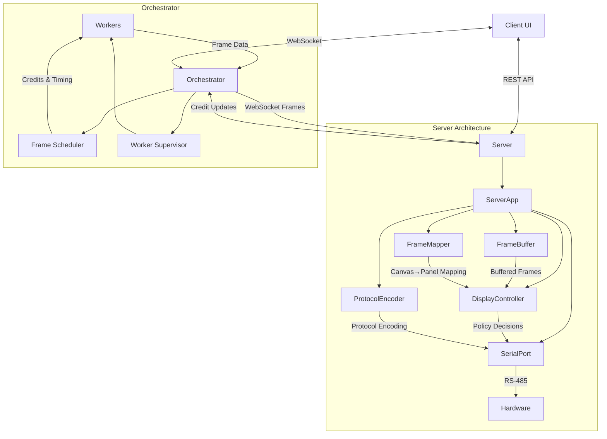

# Flip Disc Display System

A complete system for controlling Alpha Zeta flip disc displays with smooth animations and flexible panel arrangements.

## Architecture

The system follows a clean separation of concerns with proper dependency injection:

- **Server (Python)** - Hardware communication and frame buffering with clean architecture
- **Orchestrator (JS/Bun)** - Animation control and worker coordination  
- **Workers** - Frame generation (simple patterns → p5.js animations)
- **Client** - Web UI for control and preview

## Data Flow



## Quick Start

### Server Setup
```bash
cd server
./setup.sh
uv venv
python -m src.main
```

Server runs on http://localhost:8000

### Run Tests
```bash
cd server
pytest tests/ -v
```

## Project Status

✅ **Server** - Complete with tests  
🚧 **Orchestrator** - In development  
⏳ **Workers** - Planned  
⏳ **Client** - Planned  

## Hardware Support

- **Display**: Alpha Zeta flip disc panels (7×28 pixels)
- **Communication**: RS-485 serial protocol
- **Layouts**: Single panel, stacked, side-by-side, custom arrangements
- **Refresh Rate**: Up to 30 FPS

## Development

Each component has its own setup and documentation:

- [`server/README.md`](server/README.md) - Python server documentation
- `orchestrator/README.md` - Coming soon
- `client/README.md` - Coming soon

## Configuration

The server uses `config.toml` for display configuration:

```toml
[display]
panel_type = "28x7"     # "7x7", "14x7", or "28x7"
columns = 2             # Number of panels horizontally
rows = 1                # Number of panels vertically
refresh_rate = 30.0     # Target FPS
buffer_duration = 0.5   # Frame buffer duration in seconds

[serial]
port = "/dev/ttyUSB0"
baudrate = 9600
timeout = 1.0
mock = true             # Set false for real hardware
```

## Features

- **Credit System** - Prevents buffer overflow with real-time flow control
- **Panel Mapping** - Automatic canvas-to-panel conversion with orientations
- **Mock Mode** - Full development workflow without hardware
- **Test Patterns** - Built-in patterns for hardware verification
- **WebSocket + REST** - Efficient frame delivery and control APIs

## Project Context

See [`PROJECT_CONTEXT.md`](PROJECT_CONTEXT.md) for detailed architecture decisions and implementation notes.