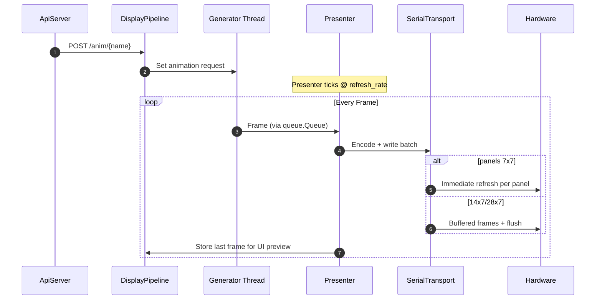

# Flip-Disc (Python, single-Pi)

A fast, robust flip-dot display controller written 100% in Python. It runs on a single Raspberry Pi (or any Linux box), exposes a FastAPI HTTP interface, runs animation generation in a background thread, and drives flip-dot panels over RS-485 with a small, protocol-correct encoder.

Highlights
- Async display presenter with deadline-based timing that paces the display (default 20 FPS) and owns serial I/O
- Threaded generator with `queue.Queue` frame buffer for smooth, backpressure-aware animation delivery
- Lightweight animation switching — no process restarts, just a reference swap and queue drain
- Segmented panel writes + proper flush semantics (7x7 immediate refresh; 14x7/28x7 buffered + flush)
- Preview isolation via asyncio queues prevents UI callbacks from blocking the main presenter loop
- Clean separation: engine (pipeline), hardware (protocol/transport), animations (step/render), web (API/UI)


## Quick Start

Requirements
- Python 3.11+
- `uv`

Install (dev) with uv:
```bash
# Install dependencies (including dev extras) using the lockfile
uv sync --extra dev
```
 
Run the server (mock serial by default):
```bash
uv run python -m flipdisc run-server --config config.toml --host 0.0.0.0 --port 8000
```

Run with hot reload for development (auto-restarts on file changes):
```bash
uv run python -m flipdisc run-server --reload
```

Endpoints @`http://localhost:8000`:
- [Status](http://localhost:8000/status): `/status`
- [API Docs](http://localhost:8000/docs): `/docs`
- [List animations](http://localhost:8000/animations): `/animations`
- [Start animation](http://localhost:8000/anim/bouncing_dot): `/anim/bouncing_dot`(POST)
- [Set refresh rate](http://localhost:8000/fps?new_fps=15): `/fps?new_fps=15` (POST)
- [Web UI](http://localhost:8000/ui): `/ui` (static page served by FastAPI)


## Configuration (config.toml)

Minimum example (works with mock serial):
```toml
[display]
# Panel grid (each panel is 14x7); default canvas = 28x28
panel_type = "14x7"     # "7x7", "14x7", or "28x7"
columns = 2              # horizontal panel count (14*2 = 28)
rows = 4                 # vertical panel count (7*4 = 28)
refresh_rate = 20.0      # frames per second paced by the server
buffer_duration = 0.5    # seconds of frames the buffer can hold
# Optional base address for the first panel (panels are addressed row-major)
address_base = 1

[serial]
# Serial transport. Use mock=true for development.
port = "/dev/ttyUSB0"
baudrate = 9600
timeout = 1.0
mock = true
```

Notes
- Width = panel_w * columns, height = panel_h * rows. With 14x7 x 2x4 -> 28x28.
- 7x7 panels do not support buffered refresh; the controller sends immediate-refresh messages without a flush.
- 14x7 and 28x7 are sent as buffered messages, then a broadcast flush is issued.
- address_base sets the starting panel address and increments per panel in row-major order.


## Fonts

Font metadata lives in `assets/text/fonts.toml`. Each section defines the parsing params for one bitmap sprite sheet:

```toml
[standard]
path = "assets/text/standard.bmp"
letter_width = 5
letter_height = 7
padding = 1
margin = 1
ascii_start = 32
letters = 95
```

Load a font by name in code:

```python
from flipdisc.fonts.loader import load_font

font = load_font("standard")   # 5×7, 95 glyphs
font = load_font("compact")    # 3×5, smaller glyph set
```

To add a new font, drop a BMP sprite sheet in `assets/text/` and add a matching section to `fonts.toml`.


## Project Layout

```
flip-disc/
├─ config.toml                # Example configuration (TOML)
├─ pyproject.toml             # Package + tooling (ruff, pytest)
├─ README.md
├─ assets/
│  └─ text/
│     ├─ fonts.toml           # Font registry (parsing params per font)
│     ├─ standard.bmp         # 5×7 bitmap font sprite sheet (95 glyphs)
│     └─ compact.bmp          # 3×5 bitmap font sprite sheet
└─ flipdisc/
   ├─ __main__.py             # `python -m flipdisc`
   ├─ __init__.py
   ├─ app.py                  # Application orchestrator (wires pipeline + API)
   ├─ cli.py                  # CLI: run-server, preview
   ├─ config.py               # Config loading + validation (TOML)
   ├─ exceptions.py           # Project-wide exception hierarchy
   ├─ logging_conf.py
   ├─ engine/                 # Pipeline runtime
   │  └─ pipeline.py          # DisplayPipeline: generator thread + async presenter
   ├─ animations/             # Animation plugins
   │  ├─ base.py              # Animation ABC, registry, factory
   │  ├─ bouncing_dot.py
   │  ├─ life.py
   │  ├─ pendulum.py
   │  ├─ simplex_noise.py
   │  ├─ text.py              # Text animation (static, scroll_left/up/down)
   │  └─ wireframe_cube.py
   ├─ fonts/                  # Bitmap font loading
   │  └─ loader.py            # BitmapFont class + load_font(name) factory
   ├─ hardware/               # RS-485 protocol + serial transport
   │  ├─ spec.py              # Protocol enums, command map, constants
   │  ├─ formats.py           # Low-level encoder (panel msgs + flush)
   │  ├─ protocol.py          # High-level ProtocolEncoder facade
   │  ├─ panel_map.py         # Slice canvas into per-panel bitmaps
   │  └─ serial.py            # Serial transports (hardware + mock)
   ├─ gfx/                    # Graphics / post-processing
   │  └─ postprocessing.py    # Binarize, dither, blur, sharpen, threshold
   ├─ web/                    # HTTP API + Web UI
   │  ├─ api_server.py        # FastAPI endpoints + WebSocket preview
   │  ├─ index.html           # Web UI template
   │  └─ static/              # JS + CSS assets
   │     ├─ app.js
   │     └─ styles.css
   └─ tests/
      ├─ test_basic.py        # Pipeline + animation smoke tests
      ├─ test_fonts.py        # Font loading + text rendering tests
      ├─ test_formats.py      # Golden tests for protocol encoding
      ├─ test_pacing.py       # Frame pacing smoke test
      └─ test_text_animation.py
```


## Control Flow


```mermaid
sequenceDiagram
    autonumber
    participant API as ApiServer
    participant Pipeline as DisplayPipeline
    participant Gen as Generator Thread
    participant Present as Presenter
    participant Serial as SerialTransport
    participant Panels as Hardware

    API->>Pipeline: POST /anim/{name}
    Pipeline->>Gen: Set animation request

    Note over Present: Presenter ticks @ refresh_rate
    loop Every Frame
        Gen->>Present: Frame (via queue.Queue)
        Present->>Serial: Encode + write batch
        alt panels 7x7
            Serial->>Panels: Immediate refresh per panel
        else 14x7/28x7
            Serial->>Panels: Buffered frames + flush
        end
        Present->>Pipeline: Store last frame for UI preview
    end
```


## Development

Run tests:
```bash
uv run pytest -q
```

Lint + format:
```bash
uv run ruff format
uv run ruff check --fix
```

Dev server with hot reload:
```bash
uv run python -m flipdisc run-server --reload
```

Tips
- Exception handling follows "log at level of knowledge": lower layers raise typed errors with context; top-level decides severity.
- Mock serial is on by default; set `mock=false` to write to real hardware.
- The generator thread uses `queue.Queue(maxsize=N)` for natural backpressure — it blocks when the buffer is full, resumes when the presenter consumes a frame.
- Animation switching is a lightweight reference swap: the main thread sets a request, the generator thread drains the queue and creates the new animation. No thread restart needed.
- NumPy releases the GIL during array operations, so the background thread provides real concurrency for compute-heavy animations.


## API (selected)

- GET `/status`: pipeline status (running, playing, frames_presented, buffer_capacity)
- GET `/animations` -> { animations }
- POST `/anim/{name}` -> start animation
- POST `/animations/configure` -> set params on current animation
- POST `/animations/reset`
- GET `/fps` -> { refresh_rate }
- POST `/fps?new_fps=20` -> update refresh rate atomically
- POST `/serial/reconnect`
