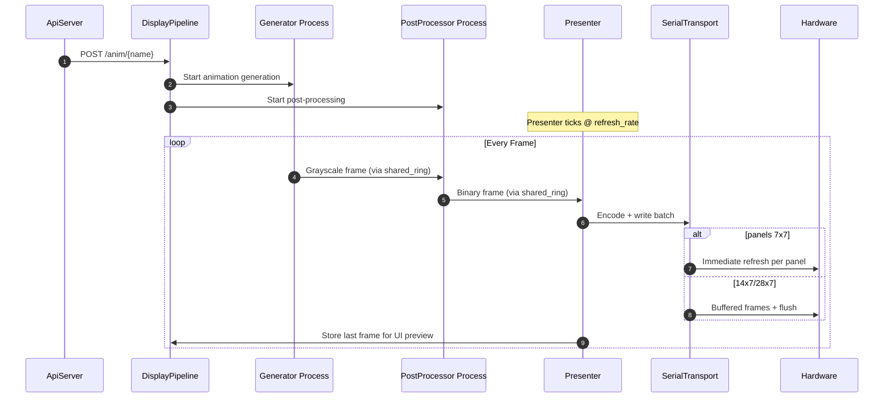

# Flip-Disc (Python, single-Pi)

A fast, robust flip-dot display controller written 100% in Python. It runs on a single Raspberry Pi (or any Linux box), exposes a FastAPI HTTP interface, spawns animation generation and post-processing processes, and drives flip-dot panels over RS-485 with a small, protocol-correct encoder.

Highlights
- Async display presenter with deadline-based timing that paces the display (default 20 FPS) and owns serial I/O
- Zero-copy shared memory rings for high-performance inter-process communication
- Multiprocessing pipeline with cooperative shutdown: Generator → PostProcessor → Presenter
- Segmented panel writes + proper flush semantics (7x7 immediate refresh; 14x7/28x7 buffered + flush)
- Preview isolation via asyncio queues prevents UI callbacks from blocking the main presenter loop
- Clean separation: engine (runtime), hardware (protocol/transport), animations (step/render), core (exceptions)


## Quick Start

Requirements
- Python 3.11+
- `uv`

Install (dev) with uv:
```bash
# Install dependencies (including dev extras) using the lockfile
uv sync --extra dev
```

Run the server (mock serial by default):
```bash
uv run python -m flipdisc run-server --config config.toml --host 0.0.0.0 --port 8000
```

Endpoints @`http://localhost:8000`:
- [Status](http://localhost:8000/status): `/status`
- [API Docs](http://localhost:8000/docs): `/docs`
- [List animations](http://localhost:8000/animations): `/animations`
- [Start animation](http://localhost:8000/anim/bouncing_dot): `/anim/bouncing_dot`(POST)
- [Set refresh rate](http://localhost:8000/fps?new_fps=15): `/fps?new_fps=15` (POST)
- [Send test pattern](http://localhost:8000/display/test/checkerboard): `/test/checkerboard` (POST)
- [Web UI](http://localhost:8000/ui): `/ui` (static page served by FastAPI)


## Configuration (config.toml)

Minimum example (works with mock serial):
```toml
[display]
# Panel grid (each panel is 14x7); default canvas = 28x28
panel_type = "14x7"     # "7x7", "14x7", or "28x7"
columns = 2              # horizontal panel count (14*2 = 28)
rows = 4                 # vertical panel count (7*4 = 28)
refresh_rate = 20.0      # frames per second paced by the server
buffer_duration = 0.5    # seconds of frames the buffer can hold
# Optional base address for the first panel (panels are addressed row-major)
address_base = 1

[serial]
# Serial transport. Use mock=true for development.
port = "/dev/ttyUSB0"
baudrate = 9600
timeout = 1.0
mock = true
```

Notes
- Width = panel_w * columns, height = panel_h * rows. With 14x7 x 2x4 -> 28x28.
- 7x7 panels do not support buffered refresh; the controller sends immediate-refresh messages without a flush.
- 14x7 and 28x7 are sent as buffered messages, then a broadcast flush is issued.
- address_base sets the starting panel address and increments per panel in row-major order.


## Project Layout (ascii)

```
flip-disc/
├─ app.py                     # Wrapper: runs flipdisc.app:main()
├─ config.toml                # Example configuration (TOML)
├─ pyproject.toml             # Package + tooling (ruff, pytest)
├─ README.md
└─ flipdisc/
   ├─ __main__.py             # `python -m flipdisc`
   ├─ __init__.py
   ├─ app.py                  # Orchestrates engine lifecycle
   ├─ cli.py                  # Small CLI: run-server
   ├─ logging_conf.py
   ├─ config.py               # Config loading + validation (TOML)
   ├─ core/
   │  └─ exceptions.py        # Project-wide exceptions
   ├─ engine/                 # Long-lived runtime components
   │  ├─ api_server.py        # FastAPI endpoints
   │  ├─ pipeline.py          # Orchestrator (generator → postproc → presenter)
   │  ├─ shared_ring.py       # SPSC shared memory ring buffers
   │  └─ processes/
   │     ├─ generator.py      # Animation generation process
   │     └─ postproc.py       # Post-processing (dithering) process
   ├─ animations/
   │  ├─ base.py              # Animation interface (step/render_gray/config/reset)
   │  ├─ bouncing_dot.py
   │  ├─ life.py
   │  └─ pendulum.py
   ├─ hardware/
   │  ├─ formats.py           # Encoder (panel msgs + flush)
   │  ├─ spec.py              # Protocol enums, command map, constants
   │  ├─ panel_map.py         # Slice canvas to per-panel bitmaps
   │  └─ transport/
   │     └─ serial.py         # Serial transports (hardware/mock)
   ├─ gfx/
   │  └─ dither.py            # Ordered Bayer, error diffusion, threshold
   └─ tests/
      ├─ test_basic.py        # Basic hardware/anim/worker assertions
      ├─ test_formats.py      # Golden tests for formats/packing
      └─ test_pacing.py       # Pacing smoke test with MockSerial
```


## Control Flow


```mermaid
sequenceDiagram
    autonumber
    participant API as ApiServer
    participant Pipeline as DisplayPipeline
    participant Gen as Generator Process
    participant Post as PostProcessor Process
    participant Present as Presenter
    participant Serial as SerialTransport
    participant Panels as Hardware

    API->>Pipeline: POST /anim/{name}
    Pipeline->>Gen: Start animation generation
    Pipeline->>Post: Start post-processing

    Note over Present: Presenter ticks @ refresh_rate
    loop Every Frame
        Gen->>Post: Grayscale frame (via shared_ring)
        Post->>Present: Binary frame (via shared_ring)
        Present->>Serial: Encode + write batch
        alt panels 7x7
            Serial->>Panels: Immediate refresh per panel
        else 14x7/28x7
            Serial->>Panels: Buffered frames + flush
        end
        Present->>Pipeline: Store last frame for UI preview
    end
```


## Development

Run tests:
```bash
uv run pytest -q
```

Lint + format:
```bash
uv run ruff format
uv run ruff check --fix
```

Tips
- The app uses the multiprocessing "fork" start method on macOS for better performance, "spawn" elsewhere.
- Exception handling follows "log at level of knowledge": lower layers raise typed errors with context; top-level decides severity.
- Mock serial is on by default; set `mock=false` to write to real hardware.
- Shared memory rings provide zero-copy communication between animation generation and presentation processes.
- Cooperative shutdown prevents data corruption during process termination; processes are given time to clean up before forced termination.


## API (selected)

- GET `/status`: pipeline status (running, playing, frames_presented) + ring buffer status
- GET `/animations` -> { animations }
- POST `/anim/{name}` -> start animation
- POST `/animations/configure` -> set params on current animation
- POST `/animations/reset`
- GET `/fps` -> { refresh_rate }
- POST `/fps?new_fps=20` -> update refresh rate atomically
- POST `/display/test/{pattern}` -> checkerboard | solid | clear
- POST `/serial/reconnect`
