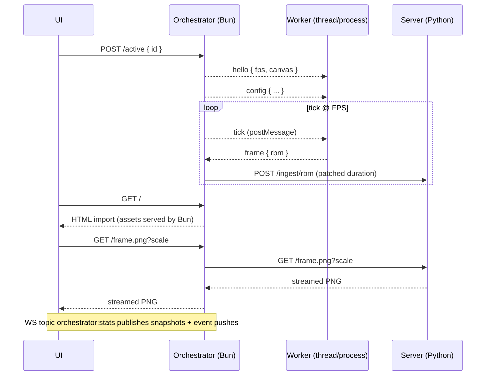

# Orchestrator (Bun/TypeScript)

Overview
- Bun-native HTTP server with `routes` (no custom router) and a lightweight UI served via HTML import.
- Drives JS workers as Bun Workers (threads) and can supervise process-backed workers (Bun.spawn scaffolding).
- Centralized RBM ingest with validation, de-duplication, and token-bucket backpressure; forwards frames to the server with patched frame duration.
- WebSocket topics publish stats every second and on important events (FPS change, errors, worker start/stop).

Sequence

Endpoints (Orchestrator)
- `GET /` UI (HTML import; assets auto-served)
- `GET /routes` Route introspection
- `GET /config` Proxy to server config
- `GET /frame.png?scale=10` Streamed proxy from server
- `GET/POST /active` Query/set active worker id
- `POST /workers/:id/start` and `POST /workers/:id/stop`
- `GET/POST /workers/:id/config` Per-worker config
- `POST /workers/:id/frame` Ingest external RBM
- `GET /fps` `POST /fps` `DELETE /fps` Proxy to server FPS
- `GET /stats` Snapshot (also published via WS)
- `GET /healthz` Health
- `GET /sources` Known/running workers
- `GET /ws` WebSocket upgrade; topic `orchestrator:stats`

Config delivery
- Post config to `POST /workers/:id/config`. Orchestrator merges it and forwards to the worker thread immediately.

Run Locally
- Install deps: `make bun-setup`
- Run: `make run-orchestrator` (serves on `http://localhost:8090`)
- Env: `SERVER_URL` to point at the Python server (default `http://localhost:8080`)
- WebSocket: `ws://localhost:8090/ws` (subscribe to `orchestrator:stats`)

Build
- Server/UI bundle: `bun run build` → `dist/`

Workers
- JS workers (threads): configured via `THREAD_SPECS` in `services/workers.ts`.
- Process workers (Python, optional): configure `PROCESS_SPECS` in `services/spawned_workers.ts`; prefer HTTP POST `/workers/:id/frame` from the process for precise framing.

Backpressure & stats
- Token bucket limits forward rate; 429 responses penalize temporarily (visible as `degraded: true` in `/stats`).
- Stats push: periodic (1 s) and on FPS change, errors, worker lifecycle.
