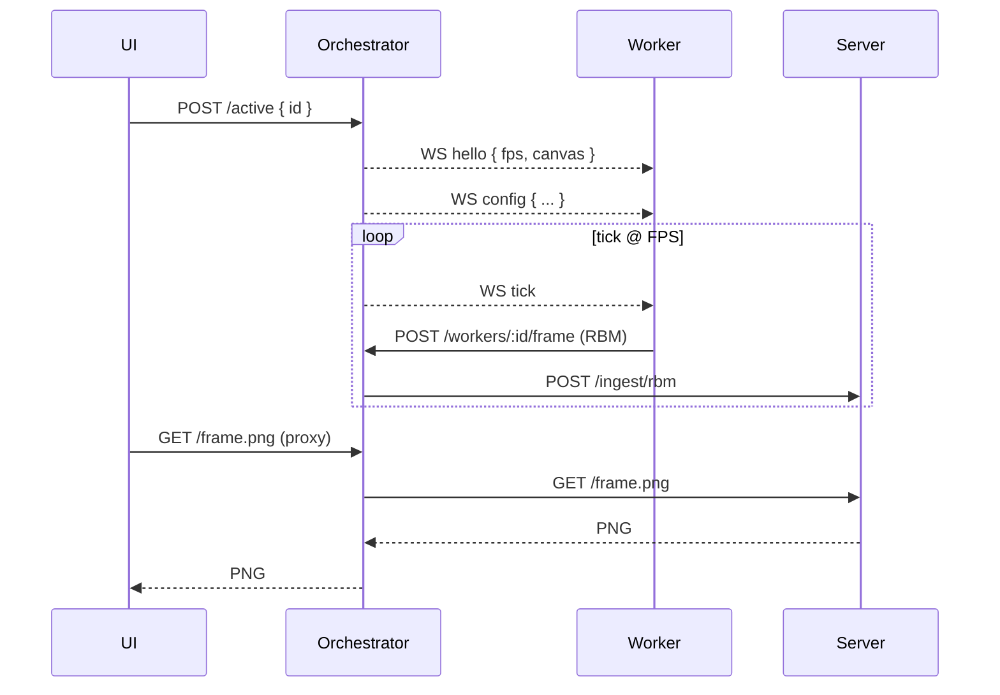

# Orchestrator (Bun/TypeScript)

Overview
- Drives workers via WebSocket ticks at the target FPS and pushes live config.
- Forwards worker RBM frames to the server, patching frame duration.
- Provides a simple UI to pick the active worker, tweak FPS, and view the feed.

Sequence

Endpoints
- WebSocket (workers): `GET /workers/:id/ws` — control channel (tick + config)
- Ingest (workers): `POST /workers/:id/frame` — latest RBM frame from worker
- Active source: `GET/POST /active` — query/set active worker id
- FPS control: `GET/POST/DELETE /fps` — proxy to server FPS config
- UI + assets: static files under `orchestrator/ui`
- Preview proxy: `GET /frame.png?scale=10` — proxy from server

Config delivery
- Post config to `POST /workers/:id/config`. Orchestrator pushes it to the worker over WS immediately.

Run Locally
- Install deps: `make bun-setup`
- Run: `make run-orchestrator` (serves on `http://localhost:8090`)
- Env: `SERVER_URL` to point at the Python server (default `http://localhost:8080`)

Spawning workers (optional)
- Orchestrator can start/stop known workers:
  - `POST /workers/:id/start` and `POST /workers/:id/stop`
- Configure known workers in `index.ts` (`WORKER_CMDS`).
