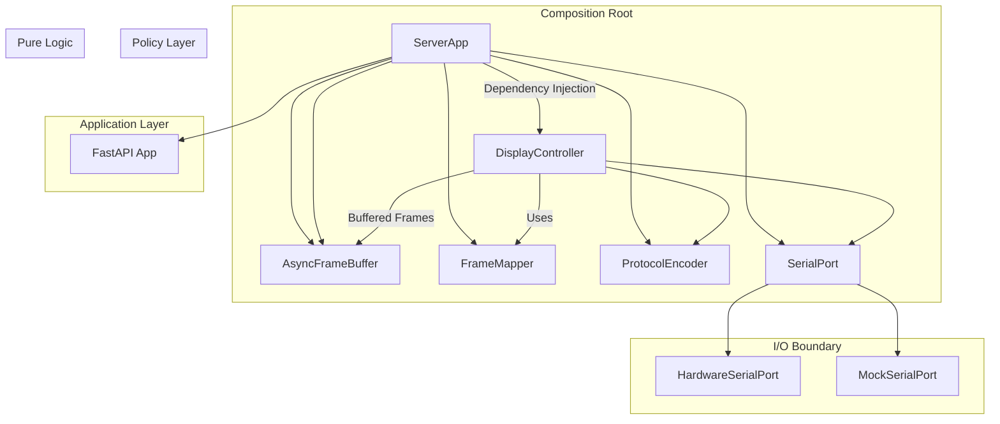

# Flip Disc Server

Python server for managing flip disc display panels via RS-485 communication. Handles frame buffering, panel mapping, and provides REST/WebSocket APIs for orchestrator communication.

## Quick Start

### Setup
```bash
./setup.sh
uv venv
```

### Run Server
```bash
python -m src.main
```

Server runs on `http://0.0.0.0:8000`
- API docs: http://localhost:8000/docs  
- WebSocket: ws://localhost:8000/ws/frames

### Run Tests
```bash
pytest tests/ -v
```

## Configuration

Edit `config.toml` to configure your panel layout:

```toml
[display]
panel_type = "28x7"     # "7x7", "14x7", or "28x7"
columns = 2             # Number of panels horizontally  
rows = 1                # Number of panels vertically
refresh_rate = 30.0     # Target FPS
buffer_duration = 0.5   # Frame buffer duration in seconds

[serial]
port = "/dev/ttyUSB0"
baudrate = 9600
timeout = 1.0
mock = true             # Set false for real hardware
```

The configuration system automatically generates panel layouts based on the display parameters. Each panel gets a unique address starting from 0.

## Architecture

The server follows a clean architecture pattern with proper separation of concerns:



### Core Components
- **ServerApp** - Composition root handling dependency injection and lifecycle
- **DisplayController** - Policy layer making high-level decisions about refresh strategies
- **FrameMapper** - Pure function converting canvas data to panel arrays
- **ProtocolEncoder** - Pure function encoding data into RS-485 protocol frames
- **SerialPort** - I/O boundary with hardware/mock implementations
- **AsyncFrameBuffer** - Frame buffering with credit system
- **Configuration System** - Flexible panel arrangements with orientations

### Architecture Benefits
- **Testability** - Pure functions (FrameMapper, ProtocolEncoder) have no I/O dependencies
- **Flexibility** - Easy to swap hardware/mock implementations via SerialPort interface  
- **Maintainability** - Clear separation between business logic and I/O operations
- **Policy Isolation** - DisplayController centralizes all refresh strategy decisions
- **Dependency Injection** - ServerApp composition root wires all components cleanly

### Credit System
The server implements a credit-based flow control system:
- Server maintains 0.5s buffer (15 frames at 30fps)
- Orchestrator gets "credits" indicating how many frames can be sent
- Prevents buffer overflow and wasted computation
- Real-time credit updates via WebSocket

## API Endpoints

### REST (Configuration & Control)
```
GET  /api/display       # Canvas dimensions for orchestrator setup
GET  /api/status        # Buffer health and connection status
GET  /api/config        # Full configuration details
POST /api/control/start # Start display loop
POST /api/control/test/{pattern} # Send test patterns
GET  /api/health        # Health check
```

### WebSocket (Frame Data)
```
/ws/frames              # Binary frame delivery + credit updates
```

Frame format: `[4B frame_id][1B flags][2B width][2B height][data]`

## Panel Configurations

### Single Panel (28×7)
```toml
[display]
panel_type = "28x7"
columns = 1
rows = 1
refresh_rate = 30.0
buffer_duration = 0.5
```

### Two Panels Side-by-Side (56×7)  
```toml
[display]
panel_type = "28x7"
columns = 2
rows = 1
refresh_rate = 30.0
buffer_duration = 0.5
```

### Two Panels Stacked (28×14)  
```toml
[display]
panel_type = "28x7"
columns = 1  
rows = 2
refresh_rate = 30.0
buffer_duration = 0.5
```

### Panel Orientations
- `normal` - No transformation
- `rot90`, `rot180`, `rot270` - Clockwise rotations
- `fliph`, `flipv` - Horizontal/vertical flip

## Development

### Mock vs Hardware
Set `mock = true` in config.toml for development without hardware.

Mock controller:
- Logs what would be sent to panels
- Simulates realistic timing delays
- Perfect for development and testing

### Test Patterns
```bash
curl -X POST http://localhost:8000/api/control/test/checkerboard
curl -X POST http://localhost:8000/api/control/test/border
curl -X POST http://localhost:8000/api/control/test/solid
```

### Testing
```bash
# Run all tests
pytest tests/ -v

# Run specific test file
pytest tests/test_config.py -v

# Run with coverage
pytest tests/ --cov=src --cov-report=html
```

### Code Quality
```bash
# Lint code
ruff check src/

# Format code  
ruff format src/

# Type checking (if mypy installed)
mypy src/
```

## Hardware Integration

### RS-485 Protocol
The ProtocolEncoder handles frame encoding with this format:
- Header: `0x80` 
- Panel address (0-255)
- Payload length (2 bytes, big-endian)
- Packed bitmap data (8 pixels per byte, MSB first)
- End of transmission: `0x8F`

Frame format: `[0x80][address][len_hi][len_lo][payload...][0x8F]`

### Serial Settings
- Default: 9600 baud, 8N1
- Configurable via config.toml
- Async communication with aioserial

## Troubleshooting

### Common Issues

**Server won't start**
- Check config.toml syntax
- Verify panel configurations don't overlap
- Ensure virtual environment is activated

**Serial connection fails**
- Check serial port permissions: `sudo usermod -a -G dialout $USER`  
- Verify port exists: `ls /dev/tty*`
- Try different baud rates

**Tests failing**
- Ensure virtual environment activated
- Run `uv pip install -e '.[dev]'` to install test dependencies

### Logging
```python
import logging
logging.basicConfig(level=logging.DEBUG)
```

Set environment variable: `export LOG_LEVEL=DEBUG`

## Production Deployment

### Raspberry Pi Setup
1. Run setup script: `./setup.sh`
2. Configure real serial port in config.toml
3. Set `mock = false` in config
4. Add to systemd or supervisor for auto-start

### Performance
- Target: 30 FPS maximum (hardware limit)
- Typical: 15 FPS for smooth animation
- Buffer: 0.5s at target FPS (configurable)

### Security
- Configure CORS appropriately for production
- Use reverse proxy (nginx) if exposing publicly
- Consider authentication for control endpoints