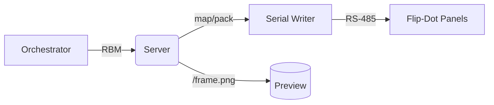

# Server (Python FastAPI)

Overview
- Owns the authoritative frame buffer and pacing close to the RS‑485 bus.
- Maps a virtual canvas to physical panels using NumPy (orientation, tiling).
- Writes frames to panels via a serial writer; exposes a PNG preview and stats.

Data Path

Key Endpoints
- `POST /ingest/rbm`: Accept RBM frames (see `protocol/rbm_spec.md`).
- `GET /config`: Current canvas, fps, panel topology.
- `GET /frame.png?scale=10`: Live preview of the latest composed canvas.
- `GET /stats`: Buffer size, effective FPS, last frame timings.
- `GET /fps`: Read target FPS; `POST /fps` to set; `DELETE /fps` to clear override.

Run Locally
- Install deps: `make uv-setup`
- Run: `make run-server` (serves on `http://localhost:8080`)

Configuration
- `config/display.yaml` controls canvas size, panels, and serial port.
- Environment overrides (examples):
  - `FLIPDISC_FPS`, `FLIPDISC_BUFFER_MS`, `FLIPDISC_FRAME_GAP_MS`
  - `FLIPDISC_SERIAL=1`, `FLIPDISC_SERIAL_DEVICE=/dev/ttyUSB0`, `FLIPDISC_SERIAL_BAUD=115200`

RBM Format
- 16‑byte header (big‑endian): magic `RB`, version, flags, width, height, seq, frame_duration_ms.
- Payload: packed MSB‑first bits, row‑major.
- Spec: `protocol/rbm_spec.md`.

Notes
- Keep‑latest semantics: oldest frames drop when buffer is full.
- Frame duration is authoritative on the server side via effective pacing.
