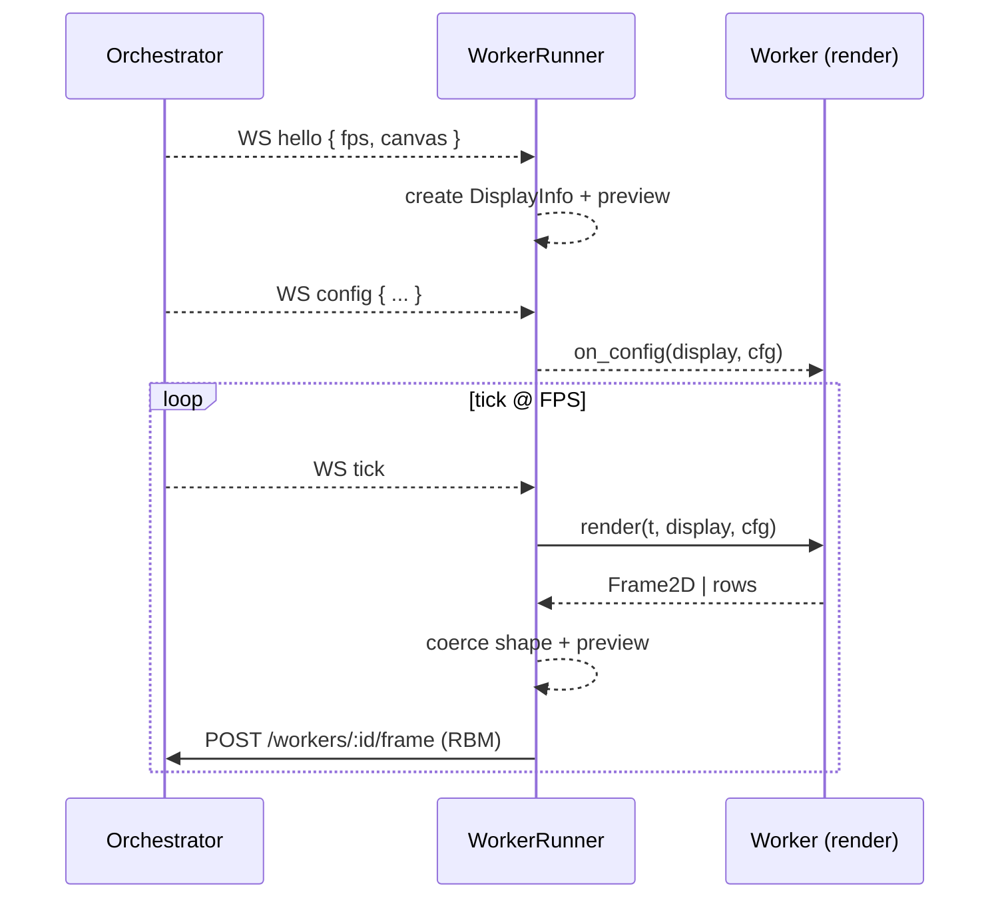

# Workers (Python)

Overview
- Workers render 1‑bit frames on demand. The orchestrator drives rendering by sending WebSocket ticks and pushes live config.
- The SDK provides a small base (WorkerBase) plus a runner and helpers.

Flow


Core Pieces
- `WorkerBase`: implement `render(t, display, cfg) -> Frame2D | rows`.
- `WorkerRunner`: connects to WS, applies `hello` (canvas/fps) and `config`, renders on `tick`, posts RBM.
- `IngestClient`: posts RBM frames to the orchestrator at `/workers/:id/frame`.
- Preview: Tk window when available; `HEADLESS=1` disables it.

Contract
- `t`: seconds since the worker started (monotonic).
- `display`: `{ width, height, fps }` discovered from the orchestrator.
- `cfg`: latest worker config dict (pushed over WS).

Getting Started
- Install deps: `make uv-setup-workers`
- Run an example:
  - `cd workers && uv run python runner.py bouncing-dot`
  - `cd workers && uv run python runner.py text-scroll`

Writing a Worker
```
from workers.common.base import WorkerBase, DisplayInfo, Frame2D

class Example(WorkerBase):
    def __init__(self):
        super().__init__("example")

    def render(self, t: float, display: DisplayInfo, cfg: dict):
        w, h = display.width, display.height
        fr = Frame2D.zeros(h, w)
        x = int((t * 5) % w)
        for y in range(h):
            fr.data[y][x] = 1
        return fr

if __name__ == "__main__":
    Example().run()
```

Notes
- Output shape must match the canvas (`strict` by default). Use `size_policy="pad"` to top‑left place/crop during prototyping.
- Keep animation time‑based (`t`) so speed remains stable regardless of pacing.
- Env: `ORCH_URL` (default `http://localhost:8090`), `HEADLESS=1` to disable preview.
