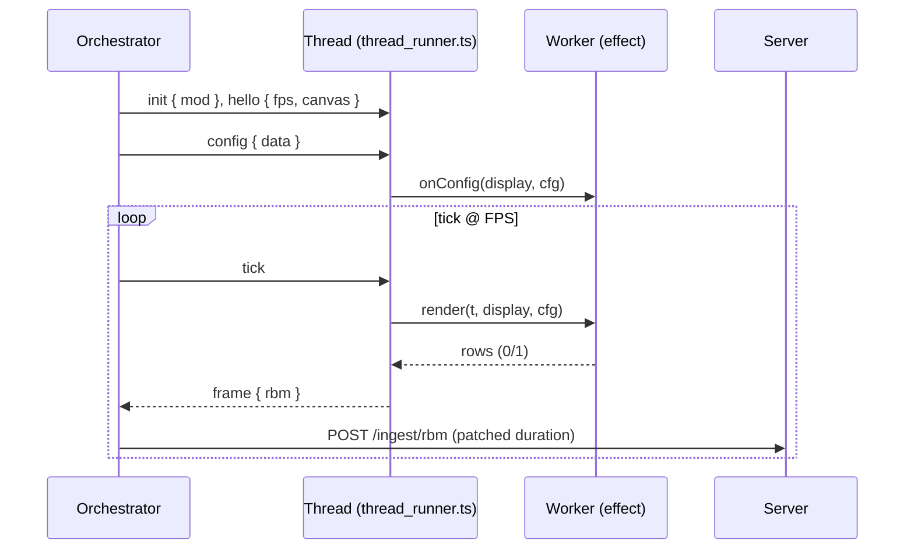

# Workers (JS/TS, thread-backed)

Overview
- The orchestrator spawns JS workers as Bun Workers (threads). No WebSockets or HTTP between orchestrator and workers.
- Each worker module exports a factory `createWorker()` returning an object with `id`, optional `onConfig()`, and `render()`.
- The `thread_runner.ts` (generic harness) loads effect modules in the thread, forwards config/ticks, and posts RBM frames back to the orchestrator.

Flow


Core Pieces
- `workers/common/thread_runner.ts`: thread harness (init/hello/config/tick → RBM frame)
- `workers/common/rbm.ts`: 1bpp packing + RBM header encoding
- `workers/common/pipeline.ts`: simple ops (invert/flip/rotate180) applied to rows
- `workers/common/font.ts`: bitmap font loader for `assets/text/standard.bmp`

Contract
- `t`: seconds since worker started (monotonic)
- `display`: `{ width, height, fps }` provided via hello
- `cfg`: latest config merged server-side and forwarded to thread

Getting Started
- Install deps: `cd workers && bun install`
- Start orchestrator: `bun orchestrator/index.ts`
- In the UI, select a worker id (e.g., `bouncing-dot-js`, `text`, `simplex-noise-js`) and click “Set Active”.

Write a Worker (TS)
```ts
import type { Rows } from "./common/pipeline";

class Example {
  readonly id = "example";
  onConfig() {}
  render(timeSec: number, display: { width: number; height: number }): Rows {
    const { width, height } = display;
    const rows: Rows = Array.from({ length: height }, () => Array(width).fill(0));
    const dotX = Math.floor((timeSec * 5) % width);
    for (let rowIndex = 0; rowIndex < height; rowIndex++) rows[rowIndex][dotX] = 1;
    return rows;
  }
}

export function createWorker() { return new Example(); }
```

Dependencies
- Each worker’s deps live under `workers/` with its own `package.json`.
- Example: `open-simplex-noise` is declared under `workers/package.json` and installed with `bun install`.

Notes
- Output shape must match the canvas. Use time‑based motion (`t`) to keep speed stable.
- No process/WS/HTTP within the repo for JS workers; everything is in-process threads.
